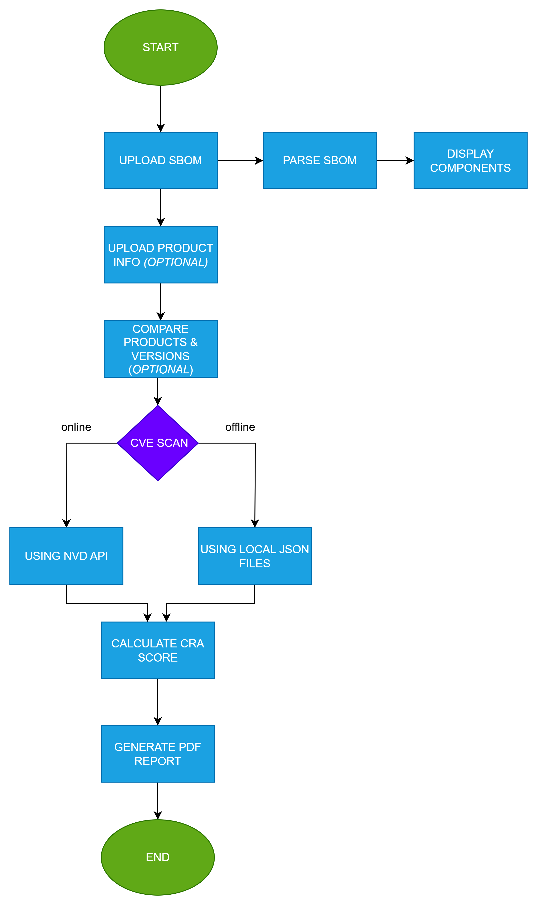

# 🛡️ CRA Analyzer – SBOM Vulnerability & Compliance Scanner

## 📌 Purpose

**CRA Analyzer** is a web-based tool designed to assess software security by analyzing SBOM (Software Bill of Materials) files. It helps organizations identify known vulnerabilities and measure compliance with the **Cyber Resilience Act (CRA)**.

### Key Features

- ✅ Upload and parse **CycloneDX** SBOM files (JSON or XML)
- 🔍 Scan for known vulnerabilities (CVE) using NVD feeds (online/offline)
- 🛡️ Automatically evaluate CRA compliance with rule-based scoring
- 📄 Generate downloadable PDF reports summarizing findings
- 🖥️ Simple web interface built with Flask & Bootstrap


---

## 🚀 Tech Stack

| Component         | Technology Used                    |
|------------------|-------------------------------------|
| Programming Language | Python                         |
| Backend Framework | Flask                             |
| Database Layer | SQLAlchemy + Flask-SQLAlchemy + PyMySQL |
| Frontend         | Bootstrap + Jinja2 (`render_template`) |
| SBOM Parsing     | Custom parser (`json`, `ElementTree`)|
| CVE Scanning | NVD API, NVD JSON feeds (`nvd-json-data-feeds`), `requests`, `lzma` |
| Version Checking      | `packaging.version`         |
| Report Generation| ReportLab (PDF)                              |
| Session & Auth  | Flask sessions                       |

---

## Installation & Setup

### Prerequisites
- Python 3.10+ recommended
- `pip` (Python package installer)
- Git (for cloning the repository)

### 1. Clone the Repository
```bash
git clone https://github.com/your-username/your-repo-name.git
cd your-repo-name
```

### 2. Create a Virtual Environment
```bash
python -m venv venv
source venv/bin/activate      # On Linux/Mac
venv\Scripts\activate         # On Windows
```
### 3. Install Dependencies
```bash
pip install -r requirements.txt
```

### 4. Database Setup
This project uses a MySQL database, and the connection is already configured with the following credentials:
```makefile
Host:     localhost  
Database: cra_analyzer  
Username: cra_user  
Password: StrongPassw0rd!
```

#### Step-by-Step
#### Step 1: Install MySQL (if not already installed)
- Download from: https://dev.mysql.com/downloads/

  
#### Step 2: Create a Database
Run the following SQL commands in your **MySQL terminal** or client (e.g., **MySQL Workbench**):
```sql
CREATE DATABASE cra_analyzer CHARACTER SET utf8mb4 COLLATE utf8mb4_unicode_ci;

CREATE USER 'cra_user'@'localhost' IDENTIFIED BY 'StrongPassw0rd!';
GRANT ALL PRIVILEGES ON cra_analyzer.* TO 'cra_user'@'localhost';
FLUSH PRIVILEGES;
```

#### Step 3: Import the Schema
Import the `cra_analyzer_backup.sql` file into the new database:
```bash
mysql -u cra_user -p cra_analyzer < cra_analyzer_backup.sql
```
If prompted, enter the password: `StrongPassw0rd!`

#### Optional: Add GUI Connection (MySQL Workbench)
To manage the database visually:
- Open **MySQL Workbench**
- Create a new connection with:
  -- Connection Name: `CRA User`
  -- Host:  `localhost`
  -- Port: `3306` (default)
  -- Username:  `cra_user`
  -- Password: `StrongPassw0rd!` (store in vault)

This allows you to explore and query the `cra_analyzer` database directly.


### 5. Run the App
```bash
python app.py
```
The application should now be running at http://127.0.0.1:5000

### 6. (Optional) Update CVE Database for Offline Scanning
After starting the application and uploading an SBOM file:
 - Go to the "CVE scan" page.
 - Click the "Update CVE Data" button.
This will download the latest known vulnerabilities (CVE) and store them locally.
You can now perform up-to-date offline scans without needing an internet connection.

---

## 💡 Usage Instructions:
Follow these steps to use the tool:

### 1. Start the Application
Make sure your virtual environment is activated, then run:

```bash
python app.py
```
The app will start and be accessible at http://127.0.0.1:5000 in your browser.

### 2. Upload an SBOM File
- Navigate to the "Upload SBOM" page.
- Choose and upload an SBOM file (in CycloneDX JSON or XML format).
- The uploaded SBOM will be parsed and display its components.

### 3. (Optional) Upload Product Metadata
- On the "Upload Product" page, you can upload additional product information to link with the SBOM file.

### 4. (Optional) Compare Products & Versions
- Navigate to the "Products" page.
- Select two uploaded products from the list.
- Click the **"Compare"** button to view a side-by-side comparison of:
  -- SBOM components
  -- Component versions
This helps identify changes between different product versions or builds, and assess how updates may have impacted the overall security posture.

### 5. Scan for Vulnerabilities (CVE)
- Go to the "CVE Scan" page.
- Choose Online or Offline scanning.
  -- Online scan pulls real-time CVE data from the NVD.
  -- Offline scan uses locally stored CVE data (after clicking Update CVE Data on the "Version Control" page).

### 6. Check CRA Compliance
- Visit the "CRA Score" page.
- The app calculates your CRA compliance score based on predefined rules and logic.
- This score helps evaluate how well your software aligns with the EU Cyber Resilience Act.

### 7. Generate Report
- On the "Reports" page, click Generate Report.
- A professional PDF report will be created, summarizing:
  -- SBOM components
  -- Detected vulnerabilities
  -- CRA compliance score
- The report is saved for later access or download.
---
<p align="center">
  
</p>

---
## 📁 Project Structure:
```plaintext
.
├── app.py
├── cra_analyzer_backup.sql
├── cra_rule_checker.py
├── last_updated.txt
├── offline_vulnerability_scanner.py
├── requirements.txt
├── sbom_parser.py
├── update_vulnerability_scanner.py
├── version_checker.py
├── version_mapping.json
├── vulnerability_scanner.py
├── .gitignore
├── .DS_Store
├── cveOffline/
├── reports/
│   └── .DS_Store
├── static/
│   ├── css/
│   │   └── style.css
│   └── js/
│       └── scripts.js
├── templates/
│   ├── index.html
│   ├── layout.html
│   ├── login.html
│   ├── register.html
│   ├── report.tex.j2
│   ├── _log.html
│   ├── _plans.html
│   ├── _products.html
│   ├── _product_add.html
|   ├── _compare.html
│   ├── _reports.html
│   ├── _scan.html
│   ├── _score.html
│   ├── _upload.html
│   └── _version.html
└── uploads/
```
